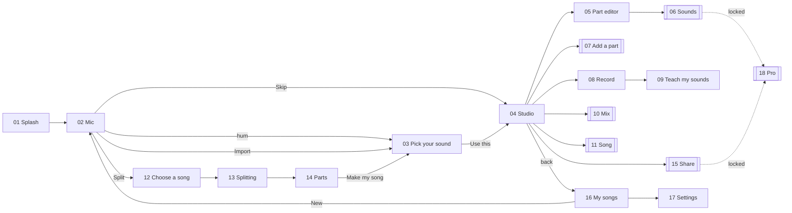

# MouthBand Design Spec

**Screens (UX) · Look (UI) · Images · Front-end build** — version 2, 1 October 2026.

For: **Antigravity (Gemini)** as image maker and front-end developer, and for anyone designing or building the MouthBand iPhone app.

> **Attach the reference screenshot** (the black / off-white / yellow taxi app kit) together with this file. Use it for **style only**. Never copy its content, words, people or cars.

**Contents**
- Part A — How to use this spec
- Part B — Screens (UX): every screen, button, state and word
- Part C — Look (UI): colours, type, shapes, components, decorations, icons, motion
- Part D — Images: how to generate the illustrations, with a fixed template
- Part E — Build: how to turn this into code in the existing app


---

# Part A — How to use this spec

## A1. Who does what

| Who | Does |
|---|---|
| **You (the designer)** | Approve the style tile, the cast sheet and the mockups. You have the final say. |
| **Antigravity (Gemini)** | Makes the illustrations (Part D) and builds the new UI in code (Part E). |
| **Claude (in this repo)** | Builds the engines for the two new features, *Bigger songs* and *Split a song*. Until those land, their screens run on mock data (E10). |

## A2. Steps in Antigravity

1. Open the `mouthband` folder. Attach the reference screenshot and this file.
2. Ask: *"Read design/DESIGN_SPEC.md. Do Part D steps 1 and 2: make the style tile and the cast sheet. Stop and show me."*
3. After you approve, ask: *"Make every image in D6 with the template in D4. Save masters in design/illustrations/src and app files as in D9."*
4. Optional: *"Make mockups of screens 01–04 with D8, for review only."*
5. Ask: *"Build Part E phase by phase on a new git branch called ui-refresh. Stop after each phase so I can check it."*
6. Check every phase against the checklist in E11.

## A3. What wins when things disagree

1. **Part B decides what is on a screen.** Part C decides how it looks.
2. **The reference screenshot decides the feel** whenever Part C is silent.
3. **Fewer words, fewer colours.** When in doubt, leave it out.
4. Never add a word that is not in Part B. Never add a colour that is not in C2.


---

# Part B — Screens (UX)

What is on each screen, where each button sits, what it does, every state, and every word. iPhone, portrait, one hand. 20 screens: 13 full screens, 6 sheets that slide up, and one set of messages.

> Emoji in this part are placeholders for icons. Use the icon map in C8.

## B1. Six rules for every screen

| Rule | Means |
|---|---|
| One big action | Each screen has one main button, in reach of the thumb. |
| Sound first | When something is ready, it plays by itself. |
| Icon + two words | No sentences on buttons. At most one short line per screen. |
| Nothing is lost | Songs save themselves. Every change has Undo. |
| Show the wait | Anything slow shows progress and time left. |
| Pro stays visible | Locked things still play a preview. Tapping 🔒 opens the Pro sheet. |

## B2. Wow moments

| Screen | Moment |
|---|---|
| 01 → 02 | The logo mark shrinks and flies into the mic button. The logo becomes the mic. |
| 02 | The rings around the mic move with your voice. |
| 03 | Your first song plays at once, starting from the chorus. |
| 05 | After ✨ Fix, a sparkle sweeps across what it changed. |
| 14 | The four parts pop in and their meters dance to the song. |
| 18 | Red confetti squares and a short chime when Pro unlocks. |

## B3. Screen map



## B4. All screens

| # | Screen | Kind | Status | Opens from |
|---|---|---|---|---|
| 01 | Splash | Screen | Same | App start |
| 02 | Mic (home) | Screen | Changed | Splash · My songs › New |
| 03 | Pick your sound | Screen | Changed | Mic · Import · Parts › Make my song |
| 04 | Studio | Screen | Changed | Pick your sound · Skip · My songs |
| 05 | Part editor | Screen | Changed | Tap a part in Studio |
| 06 | Sounds | Sheet | Changed | Sound chip on a part |
| 07 | Add a part | Sheet | New | Studio ＋ |
| 08 | Record | Screen | Changed | Studio 🎙 · Add a part |
| 09 | Teach my sounds | Screen | Same | Record · Settings |
| 10 | Mix | Sheet | Changed | Studio 🎚 |
| 11 | Song | Sheet | New | Tempo / key / shape chips in Studio |
| 12 | Choose a song | Screen | New | Mic ✂️ · My songs › New · Add a part |
| 13 | Splitting | Screen | New | Choose a song |
| 14 | Parts | Screen | New | Splitting · My songs › Splits |
| 15 | Share | Sheet | Changed | Studio ⤴ · Parts ⤴ |
| 16 | My songs | Screen | Changed | Studio ‹ · Mic ♫ |
| 17 | Settings | Screen | Same | My songs ⚙︎ · Studio ⚙︎ |
| 18 | Pro | Sheet | Changed | Any 🔒 · Settings |
| 19 | Messages | Toasts, alerts | Same | Everywhere |
| 20 | Live hum | Mode | Later | Mic · Record |

Status: **New** = new screen or part · **Changed** = exists, works differently · **Same** = keep as it is · **Later** = next phase. 🔒 = Pro (the one-time $0.99 unlock).

## B5. The screens

#### 01 · Splash

**Same** · Screen · about 1 second  
**Job:** The first impression while the app loads. Your original idea stays: logo, then straight to the mic.  
**Wireframes:** 0 – 1 s · 1.1 s · hand-over

**On screen**

| Item | Where | Does |
|---|---|---|
| Logo | Centre | 5 bars bounce like a voice level. |
| Name | Under the logo | “MouthBand” |
| Line | Under the name | “Your mouth is the whole band” |

**Rules**

- **Buttons:** None. No tap needed.
- **Time:** About 1.1 s. Never show a loading bar.

**Wow:** The logo shrinks and flies into the mic button on the next screen, same shape and same spot. The logo becomes the mic.

---

#### 02 · Mic

**Changed** · Screen · home  
**Job:** Hum, then get a song, in one tap. This is the first thing people use.  
**Wireframes:** Ready · Listening · Thinking · No tune · Mic off

**Buttons**

| Button | Where | Does |
|---|---|---|
| 🎤 Mic | Centre, big | Tap to start listening, tap again when done. It also stops by itself after 2 s of quiet (24 s max). |
| Skip | Top right | Opens Studio with an empty song. |
| 📂 Import | Bottom row | Pick a voice memo or video, then go to Pick your sound. |
| ✂️ Split (new) | Bottom row | Opens Choose a song (12). |
| ♫ Songs | Bottom row | Opens My songs (16). |
| Try again / Turn on | Under the mic | Only in the error states. Turn on opens the iPhone's Settings. |

**States**

- **Ready:** The mic “breathes” slowly. The hint bubble shows on first launch only.
- **Listening:** The mic turns red, the ring follows your voice, a live wave and timer appear. The bottom row fades.
- **Thinking:** A spinner ring, then two short lines, one after the other.
- **No tune:** One line and Try again.
- **Mic off:** One line and Turn on. Import and Split still work.

**Wow:** A haptic tap on stop, then the next screen slides in with the first song already playing.

Words: “Hum a melody” · “Tap and hum” · “Tap when done” · “Finding the beat…” · “Building your band…” · “Didn’t catch a tune” · “Try again” · “Mic is off” · “Turn on”

---

#### 03 · Pick your sound

**Changed** · Screen  
**Job:** Choose one of three songs made from your hum.  
**Wireframes:** Building · Playing

**Buttons**

| Button | Where | Does |
|---|---|---|
| Song card ×3 | Middle, stacked | Tap to play this one. The others stop. |
| 🎤 My voice | Under the cards | Adds your own voice on top, in tune and on the beat. |
| ↺ | Top left | Back to the mic to hum again. |
| **Use this** | Bottom | Saves the song and opens Studio. |

**Card shows**

- **Picture:** One per style: Lo-fi ☕ · Pop ✨ · Trap 💎 · Dance 🪩 · Band 🎸 · Cinematic 🎬
- **Name:** The style name, nothing else.
- **Part dots (new):** 10 dots in the part colours. Lit means that part plays in this song.
- **Playing:** Glow and moving EQ bars.

**Wow:** The cards flip in one by one, and the first one plays straight away, starting at the chorus.

Words: “Pick your sound” · style names · “My voice” · “Building…” · “Use this”

---

#### 04 · Studio

**Changed** · Screen · the main interface  
**Job:** Hear the song, change it and finish it. Skip on the mic screen lands here.  
**Wireframes:** Song · playing · Empty song

**Buttons**

| Button | Where | Does |
|---|---|---|
| ‹ | Top left | My songs. |
| Song name ✎ | Top centre | Tap to rename. |
| ⚙︎ | Top right | Settings. |
| Chips | Under the name | Tempo, key and shape. Any of them opens Song (11). |
| Song map (new) | Under the chips | Blocks for Intro · Verse · Chorus · Outro, with a moving playhead. Tap a block to jump there. Hold it to repeat that block. |
| Part row | Middle list | Tap to open the Part editor (05). Hold to solo. Swipe left to remove it (with Undo). |
| Sound chip | On the row | Opens Sounds (06). |
| ✨ | On the row | Shows only when Fix can help, and glows. One tap fixes that part. |
| 🔈 | Row end | Mute or unmute. |
| 🎚 Mix | Bottom bar | Opens Mix (10). |
| 🎙 Record | Bottom bar | Opens Record (08). |
| **▶ / ■** | Bottom centre, raised | Play or stop. The most-used button. |
| ＋ Add | Bottom bar | Opens Add a part (07). |
| ⤴ Share | Bottom bar | Opens Share (15). |

**States**

- **Song:** Parts list. Up to 10 rows that scroll, with the bottom bar always visible.
- **Empty:** Big 🎤, one line, Record, Hear a demo, Import.
- **Playing:** Play turns into Stop. The playhead moves on the song map.

Words: song name · “Intro” “Verse” “Chorus” “Outro” · part names · “Mix” “Record” “Add” “Share” · “Your mouth is the whole band” · “Hear a demo” · “Import”

---

#### 05 · Part editor

**Changed** · Screen · one per part  
**Job:** Change the beats or notes of one part. What the editor shows depends on the part.  
**Wireframes:** Drums · Melody · Bass · Harmony · Chords (new) · Made parts (new)

**Buttons**

| Button | Where | Does |
|---|---|---|
| Sound ▾ | Top title | Opens Sounds (06). |
| ✨ Fix | Under the title | Makes the bars agree. It glows when it can help, and shows a toast with Undo. |
| ⋯ | Top right | Clear · Remove part. |
| Grid cell | Drums | Tap to add or remove a hit. Hold to delete. |
| Note | Melody, Bass, Harmony | Drag it up or down. Tap to delete it. |
| Chord block (new) | Chords | Tap a bar to pick from 3 chords that fit. |
| Pattern / Speed (new) | Pad, Sparkle, Shaker, Whoosh | Made parts have no grid, just 2 or 3 simple choices and a volume. |
| 🎙 Redo | Bottom | Record this part again. |
| 🎤 My take | Bottom | Hear your raw recording. |
| **▶** | Bottom | Plays the song. This part plays louder than the rest. |

**My voice**

The same screen, with three controls: Tuned / Natural · Voice only (no instrument) · volume.

**Wow:** After ✨ Fix, a sparkle sweeps across the cells or notes it changed.

Words: “Fix” · “Kick” “Snare” “Hat” · “Bar 1 of 4” · “Drag up or down · tap to delete” (first time only) · “Fits here” · “Redo” · “My take” · “Clear” · “Remove part”

---

#### 06 · Sounds

**Changed** · Sheet  
**Job:** Swap the instrument of a part, or the drum kit.  
**Wireframes:** Instruments · Kits

**Buttons**

| Button | Where | Does |
|---|---|---|
| Sound tile | 3-column grid | Tap to switch. It plays a 2-second preview of your part with that sound. |
| 🔒 tile | Same grid | Still plays the preview, then opens Pro (18). |
| **Done** | Bottom | Closes the sheet. Swiping down does the same. |

**Counts**

- **Free:** 8 instruments · 2 kits
- **Pro:** 18 instruments · 8 kits
- **Filter:** Only the sounds that fit the part. Bass shows bass sounds, and so on.

Words: “[Part] sound” · “Drum kit” · sound names · “Done”

---

#### 07 · Add a part

**New** · Sheet  
**Job:** Add something new to the song: a ready-made part, a recording, or a part from another song.  
**Wireframes:** Sheet

**Buttons**

| Button | Where | Does |
|---|---|---|
| Make-one chips | Top | One tap adds the part, fitted to your song, and plays it. Parts already in the song show ✓. |
| 🎙 Record | Row | Record (08). |
| 📂 Import a recording | Row | Pick a file. It's beat-matched into this song. |
| ✂️ From a song | Row | Choose a song (12). Afterwards you pick which part to bring in. |

**Wow:** The new part drops into the list with its colour and starts playing on the next bar.

Words: “Add a part” · “Make one” · part names · “Record” · “Import a recording” · “From a song”

---

#### 08 · Record

**Changed** · Screen  
**Job:** Record a new part over the song: beatbox the drums, hum the bass or the melody.  
**Wireframes:** Ready · Count-in · Recording

**Buttons**

| Button | Where | Does |
|---|---|---|
| Part tiles | Top | Drums · Bass · Melody. The line under them changes with the part. |
| **REC / STOP** | Centre, big | 1-bar count-in, then records the loop. It stops by itself at the end. |
| 🎧 Best with headphones | Chip | A tip, not a button. Hide it once headphones are plugged in. |
| 🎯 Teach my sounds | Chip, drums only | Teach my sounds (09). Shows ✓ once done. |
| 📂 Import | Chip | Use a file instead of the mic. |
| − 96 BPM + | Bottom | Tempo. Only shown when the song is empty. |
| ⚙︎ | Top right | Click on or off · play the other parts · timing fix. |

**States**

- **Ready:** Hollow REC button.
- **Count-in:** Big 4 · 3 · 2 · 1 and the beat dots fill.
- **Recording:** Red STOP, live wave, bar progress.
- **Working:** Spinner, then back to Studio with the toast “16 hits added · Undo”.
- **Heard nothing:** “Didn’t hear any hits” + Try again.

Lines under the tiles: “B = kick · K = snare · ts = hat” · “Hum low, one note at a time” · “Hum or whistle the tune”

---

#### 09 · Teach my sounds

**Same** · Screen · about 20 seconds  
**Job:** The app learns how this person says kick, snare and hi-hat, so beatbox takes come out right.  
**Wireframes:** Step 1 of 3 · Try it

**Buttons**

| Button | Where | Does |
|---|---|---|
| **Start** | Bottom | The circle flashes 5 times. Say the sound on each flash. |
| Step pills | Top | B → K → ts. Each one ticks when done. |
| Test pads | Try it | Not buttons: the pad you made lights up. |
| **Save** · Redo | Bottom | Keep these sounds, or start again. |

Words: “Teach my sounds” · “Say B on each flash” · “Try it” · “Heard kick · 92%” · “Start” · “Save” · “Redo”

---

#### 10 · Mix

**Changed** · Sheet  
**Job:** Balance the parts and set the feel.  
**Wireframes:** Sheet

**Buttons**

| Button | Where | Does |
|---|---|---|
| Volume | One row per part | Slide to make the part louder or softer. |
| M · S | Row end | Mute · solo. |
| Straight ↔ Bouncy | Feel | Swing. |
| Loose ↔ Tight | Feel | How hard your timing snaps to the beat. |
| **Done** | Bottom | Close. |

Words: “Mix” · part names · “M” “S” · “Feel” · “Straight” “Bouncy” · “Loose” “Tight” · “Done”

---

#### 11 · Song

**New** · Sheet  
**Job:** Tempo, loop length and song shape in one place.  
**Wireframes:** Sheet

**Buttons**

| Button | Where | Does |
|---|---|---|
| − BPM + | Tempo | Slower or faster. |
| 2 · 4 · 8 bars | Loop | How long the repeating loop is. |
| Loop · Short · Full (new) | Shape | Loop repeats one block. Short is Intro · Chorus · Outro. Full is Intro · Verse · Chorus · Verse · Chorus · Outro. The preview strip updates live. |
| Snap notes | Key | Keeps every note in the song's key. The key name comes from the app. |
| **Done** | Bottom | Close. |

Words: “Song” · “Tempo” · “Loop” · “Shape” · “Short” “Full” · “Key” · “snap notes” · “Done”

---

#### 12 · Choose a song

**New** · Screen · Split, step 1  
**Job:** Pick a song file to split into parts.  
**Wireframes:** Choose · Can’t open

**Buttons**

| Button | Where | Does |
|---|---|---|
| **📂 Choose a song** | Centre, big | Opens Files. MP3, M4A, WAV or a video. |
| 4 icons | Under it | Not buttons. They show what you'll get, without words. |
| Recent row | Bottom list | Opens that split again (14) with no waiting. |

**States**

- **Too long:** “Pick a song under 10 minutes”
- **Can’t open:** “Can’t open this file” + Choose another

Words: “Split a song” · “Choose a song” · “Voice” “Drums” “Bass” “Music” · “Stays on your phone” · “Recent”

The time and length numbers are placeholders until the splitter is built and measured on an iPhone.

---

#### 13 · Splitting

**New** · Screen · Split, step 2  
**Job:** Show that the phone is working, and how long is left.  
**Wireframes:** Working

**Buttons**

| Button | Where | Does |
|---|---|---|
| Cancel | Bottom | Stops and goes back. Nothing is saved. |

**On screen**

- **Ring:** Percent done.
- **4 lanes:** Each lane fills with its waveform as that part is found.
- **Line:** Time left, counting down. Keep the screen awake.

**Wow:** When it's done: a haptic tap, the lanes fly up into the four tiles of the next screen, and the song starts playing.

Words: “Splitting” · part names · “About 40 s left · keep the app open” · “Cancel”

---

#### 14 · Parts

**New** · Screen · Split, step 3  
**Job:** Listen to each part, mute it or keep only it, then save it or turn it into your own song.  
**Wireframes:** All parts · No voice (karaoke)

**Buttons**

| Button | Where | Does |
|---|---|---|
| ▶ + wave | Top | Play or stop. Drag the wave to move through the song. |
| Part tile | 2 × 2 grid | Tap to hear only this part. Tap again to hear all. |
| 🔈 on a tile | Tile corner | Mute or unmute this part. |
| ⤴ on a tile | Tile corner | Save or share this one part. 🔒 Pro (suggested). |
| Voice only · No voice | Chips | One-tap presets. No voice is karaoke. |
| **✨ Make my song** | Bottom | Treats the voice part like a hum and goes to Pick your sound (03). |
| 💾 Save parts | Bottom | Saves all 4 parts as audio files. 🔒 Pro (suggested). |
| ⤴ | Top right | Share the current mix, as heard. |

**Pro idea**

Splitting and listening are free. Saving parts is Pro, like WAV export today. That way free users see the value before they pay.

Words: song name · “Voice” “Drums” “Bass” “Music” · “Voice only” · “No voice” · “Make my song” · “Save parts”

---

#### 15 · Share

**Changed** · Sheet  
**Job:** Get the song out: the before → after video, or the files.  
**Wireframes:** Ready · Done

**Buttons**

| Button | Where | Does |
|---|---|---|
| **🎬 Make video** | Main | Makes the vertical video, with a progress bar. |
| 🎵 Audio · 🎹 MIDI | Chips | Song files. 🔒 Pro. |
| ✂️ Parts (new) | Chip | Only for split songs. 🔒 Pro. |
| Remove 🔒 | Small line | The watermark is Pro. This opens Pro (18). |
| **Share** · Save | After it's made | iPhone share sheet (TikTok, WhatsApp…) · save to Photos or Files. |

Words: “Share” · “Make video” · “Making video…” · “Audio” “MIDI” “Parts” · “Made with MouthBand” · “Remove” · “Save”

---

#### 16 · My songs

**Changed** · Screen  
**Job:** Find, open and start songs and splits.  
**Wireframes:** List · ＋ New · Empty

**Buttons**

| Button | Where | Does |
|---|---|---|
| **＋ New** | Top | Sheet: Hum a song (02) · Start empty (04) · Split a song (12). |
| Songs · Splits (new) | Tabs | Two lists. |
| Row | List | Opens the song (04) or the split (14). |
| ⋯ | Row end | Rename · Duplicate · Delete (with a confirm). |
| “2 of 3 free songs” | Bottom, free only | Tap to open Pro (18). |
| ⚙︎ | Top right | Settings (17). |

Words: “New” · “Songs” “Splits” · “Hum a song” · “Start empty” · “Split a song” · “Rename” “Duplicate” “Delete” · “2 of 3 free songs” · “No songs yet”

---

#### 17 · Settings

**Same** · Screen · shorter labels  
**Job:** The few things people may want to change. Nobody needs it to start.  
**Wireframes:** List

**Rows**

| Row | Kind | Does |
|---|---|---|
| Click while recording | Toggle | Metronome while you record. |
| Play other parts | Toggle | Hear the band while you record. |
| Timing fix | Slider | If hits land late, slide right. Shown with a small “Late? Slide right” hint. |
| Open on the mic | Toggle | Off means the app opens your last song. |
| Teach my sounds | Row › | Teach my sounds (09). Reset is in its ⋯ menu. |
| Snap to key | Toggle | Keeps hummed notes in the key. |
| Unlock Pro · Restore purchase | Rows › | Pro (18) · asks Apple for an earlier purchase. |

---

#### 18 · Pro

**Changed** · Sheet · one $0.99 unlock  
**Job:** Explain Pro in five lines and sell it in one tap.  
**Wireframes:** Sheet

**Buttons**

| Button | Where | Does |
|---|---|---|
| **Unlock · $0.99** | Bottom | Apple's purchase sheet. The price comes from the store. |
| Restore | Under it | Required by Apple. Gets back an earlier purchase. |

**States**

- **Buying:** The button turns into a spinner.
- **Done:** Confetti and “Welcome to Pro”. All 🔒 badges disappear.
- **Store busy:** Toast: “Can’t reach the store. Try again.”

**What opens it**

Any 🔒 sound or kit · Audio, MIDI or Parts in Share · Remove watermark · Save parts · the 4th song · Unlock Pro in Settings.

Words: “PRO” · “Unlock everything” · the 5 perks · “Unlock · $0.99” · “One time. No subscription.” · “Restore” · “Welcome to Pro”

---

#### 19 · Messages

**Same** · Toasts, confirms, haptics  
**Job:** Short feedback that never blocks the screen.  
**Wireframes:** Toast · Confirm

**Kinds**

| Kind | Where | Rule |
|---|---|---|
| Toast | Above the bottom bar | 3 seconds. One line. Undo when something changed. |
| Confirm | Small sheet | Only for deleting. A red button, then Cancel. |
| 🔒 badge | On tiles and chips | Never hides the item. |
| Haptic tap | — | Stop recording · result ready · Fix · purchase. |

Toasts: “16 hits added · Undo” · “✨ Fixed 4 hits · Undo” · “Every bar already agrees” · “Saved ✓” · “Duplicated” · “Deleted · Undo” · “Welcome to Pro”

---

#### 20 · Live hum

**Later** · Mode on the Mic and Record screens  
**Job:** Hear an instrument follow your voice while you hum. Design it now; it ships in a later version.  
**Wireframes:** Live on · No headphones

**Buttons**

| Button | Where | Does |
|---|---|---|
| 🎧 Live | Top chip | On or off. When on, the instrument plays as you hum, and notes appear as you sing. |
| Sound ▾ | Next to it | Opens Sounds (06). |

Wireless earbuds add a delay and the speaker leaks into the mic, so Live asks for wired headphones.

---

## B6. Parts and their icons

One icon per part, used everywhere (rows, chips, tiles). The old rainbow part colours are retired (see C2).

| Part | Icon (Lucide) | What it is, in plain words | Status |
|---|---|---|---|
| Drums | `drum` | Kick, snare, hi-hat | Same |
| Bass | `guitar` | The low notes | Same |
| Chords | `piano` | The harmony under the tune | Same |
| Melody | `music` | Your hum, played by an instrument | Same |
| My voice | `mic-vocal` | Your real voice, tuned. Now its own row. | Changed |
| Pad | `cloud` | A soft background sound | New |
| Sparkle | `sparkle` | Quick repeating notes that follow the chords (an arpeggio) | New |
| Shaker | `hand` | Claps and shakers on top of the drums | New |
| Harmony | `music-2` | A second voice that sings with your melody | New |
| Whoosh | `wind` | The rising sound before a big moment | New |

Song sections: **Intro · Verse · Chorus · Outro**. Split parts: **Voice · Drums · Bass · Music**.


---

# Part C — Look (UI)

## C1. Style DNA — what we take from the reference

The reference is a taxi-app UI kit: warm off-white screens, black ink, a loud yellow, heavy condensed uppercase titles, square two-part buttons with hard black shadows, and flat line-art people. MouthBand keeps the feel and swaps the subject and the colour.

| Keep from the reference | Change for MouthBand |
|---|---|
| Warm off-white screens, black ink, **one** loud accent | Yellow becomes **Stage Red**. The orange second accent is dropped: red is the only accent. |
| Huge condensed UPPERCASE titles, left-aligned, 2–3 lines | Same, with our words from Part B. |
| One title word on a solid accent block ("TAP AWAY") | Same: a red block with black text. At most one per screen. |
| Two-part buttons: accent label block + black arrow square + hard black shadow | Same, red + black. |
| Square corners and 2px black borders on key controls | Same. |
| Calmer rounded white cards and toggles on list screens (profile, settings) | Same for My songs, Settings and sheets. |
| Dot grid, two offset squares, a black-and-white stripe band | Dot grid = a **speaker grille**. Offset squares = **drum pads**. The stripe band becomes a **piano-key band**. |
| Map with a black route line, a start dot and an end square | A black **sound line** (zigzag wave) with a red start dot and a black end square. |
| Flat line-art people with the accent on their clothes; cars | Same style, red clothes. Instruments, headphones, phones and speakers instead of cars. |
| Outline icons; accent squares holding black glyphs | Same: red squares holding black glyphs. |

## C2. Colours

| Token | Name | Hex | Use |
|---|---|---|---|
| `--ink` | Ink | `#111111` | Text, 2px borders, icons, arrow blocks, hard shadows |
| `--paper` | Paper | `#F6F4EF` | Every screen background |
| `--white` | White | `#FFFFFF` | Cards, sheets, fields, tiles |
| `--red` | Stage Red | `#F0443A` | Main buttons, highlight blocks, active states, the mic, red in illustrations |
| `--red-ink` | Deep Red | `#C8281F` | Small red text and links on paper or white |
| `--red-tint` | Blush | `#FDE6E2` | Soft red fills: Pro card, selected list rows, icon circles |
| `--graphite` | Graphite | `#5E5B57` | Secondary text |
| `--stone` | Stone | `#D9D6CF` | Light borders, dividers, inactive things |
| `--mist` | Mist | `#ECE9E3` | Track backgrounds, skeletons, disabled fills |
| `--ok` | Green | `#1F9D55` | Tiny success badges only |

Contrast (checked): ink on paper 17 : 1 · graphite on paper 6.1 : 1 · ink on Stage Red 5.0 : 1 · Deep Red on paper 5.0 : 1.

**Rules**
- Ink, paper and red do 95% of the work. Graphite, stone and mist help. Green only appears in tiny success badges.
- One red main button per screen. Red covers no more than about 10% of a screen.
- Text on red is always **ink**. Text on ink is white. Never put red text on red.
- Small red text (links) uses **Deep Red**, never Stage Red.
- The old part colours (orange drums, violet bass, pink melody, green chords) are retired. Parts are told apart by icon and name. "Now / active / selected" is red.
- Light look only. Do not build a dark mode now.

## C3. Type

Three free fonts (SIL Open Font License), all bundled in the app (see E5).

| Role | Font | Size / line height | Case | Used for |
|---|---|---|---|---|
| Hero | Anton 400 | 64 / 60 | UPPER | Splash wordmark |
| H1 | Anton 400 | 40 / 40 | UPPER | Screen titles |
| H2 | Anton 400 | 28 / 30 | UPPER | Sheet titles, big numbers |
| H3 | Anton 400 | 20 / 22 | UPPER | Card and tile titles |
| Button | Barlow Condensed 700 | 18 / 20, +0.04em | UPPER | All buttons |
| Label | Barlow Condensed 700 | 13 / 16, +0.06em | UPPER | Field labels, section labels, chips, tabs, links |
| Body | Barlow 500 | 15 / 22 | Sentence | The line under a title, list titles |
| Small | Barlow 400 | 13 / 18 | Sentence | List subtitles |
| Caption | Barlow 500 | 11 / 14 | Sentence | Labels under icons in the bottom bar |
| Numbers | Barlow Condensed 700, tabular figures | as needed | — | BPM, timers, %, counts |

- Titles are left-aligned, 2–3 lines, tight. Only the Splash centres its title.
- At most about 14 characters per title line. Break lines by meaning: "HUM A / MELODY".
- Never use Anton for sentences. Never use more than one Anton size on the same screen besides H1 + numbers.

## C4. Layout and spacing

- Design frame: iPhone **393 × 852** pt, portrait. Safe areas: 59 pt top, 34 pt bottom.
- Side margin **20**. Spacing scale: 4 · 8 · 12 · 16 · 20 · 24 · 32 · 40 · 56.
- Every screen follows the same anatomy, top to bottom:
  1. **Top row** (48 high): a square back button on the left; a text link or icon on the right.
  2. **Title block**: H1 (2–3 lines), optionally one Body line under it, one decoration at the top-right.
  3. **Content**.
  4. **Action zone**: the main button pinned to the bottom, 20 from the sides, 16 above the safe area.
- Touch targets at least 44 × 44. Main buttons 56 high.

## C5. Shape, borders and depth

| Thing | Corners | Border | Shadow |
|---|---|---|---|
| Buttons, icon buttons, fields, square tiles, song-map blocks | 0 | 2px ink | Main button: hard `4px 4px 0` ink |
| Bold cards (song choices, split tiles) | 0 | 2px ink | When selected: hard `4px 4px 0` ink |
| List cards (My songs, Settings, sheet rows) | 12 | 1.5px stone | none |
| Chips and badges | 6 | 1.5px ink | none |
| Segmented controls | 8 | none (mist fill) | none |
| Sheets | 20 (top only) | 2px ink line on top | soft `0 -8px 24px` ink at 12% |
| Toggles | pill | none | none |
| Mic and REC buttons | circle | 2.5px ink | hard `6px 6px 0` ink |

- Hard shadows are always ink, offset down-right, never blurred.
- Pressed: the thing moves 2px down-right and its shadow shrinks to 2px, like a key going down.
- The mic and REC buttons are the **only circles**. That makes them the most important things on screen.

## C6. Components

**Main button ("arrow bar")**
- 56 high, full width. Left: red block with the label in Button style, ink, centred. Right: a 56 × 56 ink square with a white `arrow-right` icon (24).
- One 2px ink outline around both parts; hard shadow `4px 4px 0` ink.
- Pressed: moves 2px. Disabled: mist fill, graphite label, graphite arrow block, no shadow. Busy: a white spinner replaces the arrow.
- Used for: Use this · Make my song · Make video · Unlock · $0.99 · Turn on · Try again.

**Two-choice bar** (like SKIP | NEXT in the reference)
- One outline, one shadow: [white block, ink label] [red block, ink label] [ink arrow square].
- Used for: HUM AGAIN | USE THIS on screen 03.

**Secondary button** — 52 high, white, 2px ink border, ink label, no shadow. Cancel, Redo, Save parts, Hear a demo.

**Delete button** — red fill, ink label, no arrow, no shadow. Only in the delete confirm.

**Text link** — Label style at 14, ink, 2px underline 3px below. One link per screen may use Deep Red. (SKIP, RESTORE)

**Icon button** — 40 × 40 square, 2px ink border, ink icon 20. Ghost version without border for top-right icons.

**Accent tile** — 48 × 48 red square holding an ink icon (24). The ink-square version holds a white icon.

**Chip** — 32 high, 0 12 padding, 1.5px ink border, corners 6, Label style. Selected: ink fill, white text. Attention (Fix): red fill, ink text.

**Segmented control** — mist container, corners 8, 3px inside padding. Active segment: ink fill, white Label. Others: ink Label on mist.

**Toggle** — 50 × 30 pill. On: red with a white knob. Off: stone with a white knob.

**Slider** — 4px ink line on mist; the filled part is red; knob 22 × 22 white **square** with a 2px ink border.

**Field** (rename a song) — Label above. 52 high, white, 2px ink border, square. Focus: red border and a 3px blush ring.

**Bold card** — white, 2px ink border, square, 12 padding. Playing/selected: an 8px red strip on the left edge, hard shadow, moving EQ bars.

**List card** — white, 1.5px stone border, corners 12, 14 padding. Left: 40 × 40 blush circle with an ink icon. Title in Body 600, subtitle Small graphite. Right: `chevron-right` or `ellipsis`.

**Part row** (Studio) — rows 56 high inside one white list card, split by 1px stone lines.
- Left: 40 × 40 square icon tile (2px ink border, ink icon). Muted: mist tile, graphite text. Selected or soloed: red tile.
- Middle: part name (Body 600) and its sound chip.
- Right: the Fix chip (red, `wand-sparkles`, only when Fix can help), then the speaker icon.

**Song map** — a row of square blocks, 32 high, 2px ink border, Label text (INTRO, VERSE, CHORUS, OUTRO). Chorus blocks are red. Playhead: a 3px ink line with an 8 × 8 red square on top.

**Drum grid** — 16 square cells per bar, 18 × 18, 1.5px ink border; every 4th cell has a thicker left edge. Kick = ink fill · Snare = red fill · Hat = white with a small ink dot. Shape and colour together, so it still reads in black and white.

**Piano roll** — lanes on mist with 1px stone lines. Notes are ink bars with square ends. The selected note is red with a 2px ink border.

**Split tile** — square white card with a 2px ink border: a 40 × 40 blush icon square, an H3 title, and an 8-bar ink level meter whose active bars turn red. Solo: red fill, ink text, hard shadow. Muted: 35% opacity and a `volume-x` icon.

**Toast** — ink box, square, white Body 600, action in red Label ("UNDO"). Sits above the bottom bar for 3 seconds.

**Sheet** — paper, top corners 20, 2px ink line on top, a 36 × 4 stone grabber. Title in H2, left-aligned. Its main button at the bottom.

**Bottom action bar** (Studio) — white, 2px ink line on top, 5 slots: Mix · Record · Play · Add · Share, each with a 24 icon and a Caption. The centre Play is a 64 × 64 **red square**, 2px ink border, hard shadow, ink play icon, raised 16 above the bar. While playing it becomes an ink square with a red stop icon.

**PRO badge and lock** — PRO: a red block with ink Anton 13, padding 2 × 6. Lock: a 20 × 20 ink square with a white `lock` icon (12) on the top-right corner of a tile.

**Progress** — Bar: 10 high, mist, red fill, 2px ink outline. Ring (Splitting): 12px red stroke on mist, the % in H2 inside.

**Mic button** — a 168 circle, red, 2.5px ink border, hard shadow `6px 6px 0` ink, ink `mic` icon at 56. Listening: three 2px dashed ink rings around it grow and shrink with the voice; the timer (Numbers) sits above.

## C7. Decorations (the pattern)

Use at most **two** per screen. They are quiet; the content is loud.

| Name | Looks like | Where |
|---|---|---|
| Offset squares | A 14 × 14 ink square and a 14 × 14 red square touching corner to corner | Top-right of titles |
| Speaker grille | 5 × 5 ink dots, 3px dots on an 8px grid | A top corner of Splash, Pro and empty states |
| Piano band | A full-width band of piano keys: white keys with 2px ink lines, black keys at 60% height | Bottom of the Splash and the Pro sheet |
| Highlight | One title word on a red block (padding 0 × 6) | At most one per screen: Splash "BAND", Mic "MELODY" |
| Sound line | A thick ink zigzag with a red dot at the start and an ink square at the end | Splitting, empty states |
| Red slab | A red parallelogram behind a hero illustration | Splash, Pro |

## C8. Icons

- **Lucide** icon set (free, MIT). 24 grid, 2px stroke, round ends. Ink by default; red when active. Check the exact names at lucide.dev/icons.
- Every emoji in Part B becomes an icon from this map.

| Use | Lucide name | Use | Lucide name |
|---|---|---|---|
| Mic | `mic` | Mic off / No voice | `mic-off` |
| Back | `arrow-left` | Main button arrow | `arrow-right` |
| Import | `folder-open` | Split | `scissors` |
| My songs | `list-music` | Settings | `settings` |
| Mix | `sliders-horizontal` | Record | `circle-dot` |
| Play / Stop | `play` / `square` | Add | `plus` |
| Share | `share` | Fix | `wand-sparkles` |
| Mute / Unmute | `volume-x` / `volume-2` | Undo | `undo-2` |
| Pro lock | `lock` | Headphones | `headphones` |
| Hum again | `rotate-ccw` | Teach my sounds | `target` |
| Video | `clapperboard` | Audio file | `file-audio` |
| MIDI | `keyboard-music` | Save | `download` |
| Rename | `pencil` | Duplicate / Delete | `copy` / `trash-2` |
| More | `ellipsis` | Open | `chevron-right` |
| Done / Selected | `check` | Close | `x` |
| Repeat a block | `repeat` | Pro | `crown` |

Part icons are in B6.

## C9. Motion

| Moment | What moves | Time |
|---|---|---|
| Any press | Moves 2px down-right, shadow shrinks | 120 ms |
| Chips, toggles, tabs | Fill changes | 200 ms |
| Sheets and screens | Slide up / slide in from the right | 280 ms |
| Splash | The 5 bars of the mark bounce; at 1.1 s the mark flies into the mic (shared-element move) | 600 ms loop, then 400 ms |
| Listening | Rings around the mic follow the voice level | live |
| Song cards appear | Stack in from 16px below, 60 ms apart | 280 ms |
| Split done | The 4 lanes fly up into the 4 tiles | 400 ms |
| Pro unlocked | Red confetti squares fall once | 1.2 s |

Easing: `cubic-bezier(.2, .8, .2, 1)`. If the phone has Reduce Motion on, replace every move with a 150 ms fade.

## C10. Accessibility

- Touch targets at least 44 × 44. Text contrast at least 4.5 : 1 (already true for the C2 pairs).
- Never use red as the only signal: always add an icon or a word (Fix chip, solo tile, locks).
- Every icon-only button has a spoken name (for example "Settings", "Back", "Mute drums").
- Text sizes in `rem`, so the iPhone's larger text setting works up to 130% without clipping.
- Focus: a 3px red outline, 3px away from the element.

## C11. Logo, app icon and splash

- **Wordmark:** "MOUTH" over "BAND" in Anton; "BAND" sits on a red block.
- **Mark** (small logo): a red square, 2px ink border, holding 5 ink bars (heights 40 / 70 / 100 / 65 / 35%).
- **App icon** (1024 × 1024): red background with the 5 ink bars centred, no border, fully opaque (Apple adds the rounded mask).
- Draw the logo and the app icon as **vectors (SVG)**, by hand or in Figma. Never with the image model.
- **Splash (screen 01):** paper background; speaker grille top-left; a small red square top-right; the wordmark; one line "YOUR MOUTH IS THE WHOLE BAND."; illustration ILL-01 on a red slab; the piano band along the bottom. At 1.1 s the mark flies into the mic.

## C12. Screen by screen

| # | Screen | Title (H1) | Look |
|---|---|---|---|
| 01 | Splash | MOUTH / **BAND** | Wordmark, ILL-01 on a red slab, grille, piano band. |
| 02 | Mic | HUM A / **MELODY** | Small mark + SKIP link on top. The red mic circle in the middle. Three square icon tiles at the bottom (Import · Split · Songs), each with a Label. ILL-03 / ILL-04 in the two error states. |
| 03 | Pick your sound | PICK YOUR / SOUND | Three bold cards with style art (ST-01…06) and 10 tiny part squares (filled = plays). The playing card gets the red strip and shadow. MY VOICE chip. Two-choice bar at the bottom. |
| 04 | Studio | Song name (H2) | Chips row, song map, parts list card, bottom action bar with the red Play square. Empty state: ILL-02 + main button "RECORD" + secondary "HEAR A DEMO". |
| 05 | Part editor | Part name (H2) | Drum grid / piano roll / chord blocks (big Anton letters in square tiles) / segmented controls for made parts. |
| 06 | Sounds | [PART] SOUND | Sheet with a 3-column grid of square tiles. Selected = red tile. Locked = lock badge. |
| 07 | Add a part | ADD A PART | Sheet: "MAKE ONE" chips, then three list cards. |
| 08 | Record | RECORD | Three square part tiles (selected = red). REC is a red circle like the mic. Count-in in Hero size. Four beat squares fill with ink. |
| 09 | Teach my sounds | TEACH MY / SOUNDS | A big red square flashes with the sound ("B") in Hero size. ILL-05 on the first visit. |
| 10 | Mix | MIX | Sheet: rows with an icon tile, slider and square M / S toggles. |
| 11 | Song | SONG | Sheet: tempo stepper, segmented controls, song-map preview, snap toggle. |
| 12 | Choose a song | SPLIT A / SONG | Dashed 2px ink drop box with `folder-open` and "CHOOSE A SONG". Four part icons in squares. ILL-06. Recent list cards. |
| 13 | Splitting | SPLITTING… | Red progress ring, four lanes drawn as sound lines, "ABOUT 40 S LEFT", secondary CANCEL. ILL-07. |
| 14 | Parts | Song name (H2) | Play square + wave, 2 × 2 split tiles, two chips, main button MAKE MY SONG, secondary SAVE PARTS with a lock. |
| 15 | Share | SHARE | Sheet: vertical video preview with BEFORE / AFTER labels, main button MAKE VIDEO, chips. ILL-12 while it renders. |
| 16 | My songs | MY / SONGS | Offset squares. Main button NEW. Segmented SONGS / SPLITS. List cards. Empty: ILL-08. |
| 17 | Settings | SETTINGS | Grouped list cards with icons and red toggles, like the reference settings screen. |
| 18 | Pro | UNLOCK / EVERYTHING | Sheet: PRO badge, ILL-09 on a red slab, five perk rows with red accent tiles, main button UNLOCK · $0.99, piano band. |
| 19 | Messages | — | Ink toasts; a small confirm sheet with the red delete button. |
| 20 | Live hum | — | A LIVE chip with `headphones`; ILL-10 and ILL-11. |


---

# Part D — Images

## D1. What the image model makes, and what it doesn't

| Image model makes | Never with the image model |
|---|---|
| Illustrations: people, objects, small scenes (D6) | The logo, wordmark and app icon (vectors, C11) |
| The six style pictures on the song cards (ST-01…06) | UI icons (Lucide, C8) |
| Optional screen mockups for review only (D8) | Buttons, text, numbers, anything the user reads |

## D2. Workflow

1. **Style tile.** Make one image that locks the look (prompt in D5). Get approval.
2. **Cast sheet.** Make the three characters in one image (prompt in D5). Get approval. From now on, attach the style tile and the cast sheet as reference images to every prompt.
3. **Each image.** Build the prompt with the template in D4, using the lines in D7. One image per prompt. Make 3–4 options and keep the best.
4. **Clean up.** Background exactly as listed in D6, crop to the aspect ratio, check against D10. Regenerate anything that fails; don't fix it by hand.
5. **Export** as in D9.
6. **Put the files in the app** as in E8.

Tips for Gemini: keep prompts literal and short; say the colours by hex; repeat each character's exact description every time; if colours drift, regenerate with "use ONLY these exact colours" added.

## D3. The style block

Paste this at the start of every illustration prompt, unchanged.

```text
STYLE — MouthBand illustration.
Flat vector editorial illustration, like a modern mobile-app onboarding scene.
Bold black outlines (#111111), one even stroke weight (about 6 px on a 2048 px canvas), rounded line ends.
Flat colour fills only: no gradients, no textures, no 3D, no soft shadows, no glow, no blur.
Colours allowed: black #111111, white #FFFFFF, off-white #F6F4EF, stage red #F0443A, light warm grey #E6E3DC, plus natural flat skin tones.
Red is used for clothing and for one key object only. Everything else is black, white or grey.
Simple friendly faces: dot eyes, small curved smile, solid black hair.
A few short motion dashes next to things that move or make sound.
No text, letters, numbers, logos or watermarks anywhere.
```

## D4. The prompt template

```text
[the STYLE block from D3]

SUBJECT: <who or what>, <doing what>.
DETAILS: <2–4 concrete details>.
COMPOSITION: <full body | waist-up | object only>, <facing left | right | front>, subject centred, 12% empty margin on every side.
EXTRAS: <none, or up to two of: two small offset squares (one black, one red) · a 5×5 black dot grid · a red parallelogram behind the subject · a black zigzag sound line>.
BACKGROUND: plain flat <#F6F4EF | #FFFFFF>, nothing else.
FORMAT: aspect ratio <1:1 | 5:4 | 4:3>, the largest size available, PNG.
AVOID: yellow, orange, blue, green, purple; gradients; photo realism; busy backgrounds; extra people; any text; cropped heads or hands.
```

## D5. Style tile and cast

**Style tile prompt**

```text
[the STYLE block from D3]

SUBJECT: a tidy style board for a music app, showing: MAYA (exact description below) waist-up holding a phone; a vintage microphone; a pair of wired headphones; a small drum; a row of three plain colour circles in black, red #F0443A and off-white.
COMPOSITION: objects arranged in a loose 2×3 grid with lots of space between them.
EXTRAS: two small offset squares (one black, one red); a 5×5 black dot grid.
BACKGROUND: plain flat #F6F4EF.
FORMAT: aspect ratio 4:3.
AVOID: any text or labels, other colours, gradients, shadows.
```

**The cast** — always describe a character with exactly these words.

| Name | Role | Always looks like |
|---|---|---|
| **MAYA** | The hummer (hero) | a woman in her twenties with deep brown skin, black hair in a high bun, a red hoodie, black jeans, white sneakers and white wired earphones |
| **LEO** | The beatboxer | a man in his twenties with light brown skin, short black curly hair, a red cap worn backwards, a black t-shirt and red sneakers |
| **SAM** | The splitter | a teenager with pale skin and a few freckles, straight black hair with a fringe, round black glasses, a white t-shirt under an open red jacket |

**Cast sheet prompt**

```text
[the STYLE block from D3]

SUBJECT: a character sheet of three people standing side by side, full body, front view, relaxed and smiling:
MAYA — a woman in her twenties with deep brown skin, black hair in a high bun, a red hoodie, black jeans, white sneakers and white wired earphones;
LEO — a man in his twenties with light brown skin, short black curly hair, a red cap worn backwards, a black t-shirt and red sneakers;
SAM — a teenager with pale skin and a few freckles, straight black hair with a fringe, round black glasses, a white t-shirt under an open red jacket.
COMPOSITION: equal spacing, same height scale, 10% margin.
BACKGROUND: plain flat #F6F4EF.
FORMAT: aspect ratio 3:2.
AVOID: name labels or any text, other colours, gradients, shadows.
```

## D6. Image list

"Shown at" is the size on screen in points. The app file is 3× that in pixels.

| ID | Screen | Shown at (pt) | App file (px) | Aspect | Background | File name |
|---|---|---|---|---|---|---|
| ILL-01 | 01 Splash | 320 × 256 | 960 × 768 | 5:4 | #F6F4EF | `ill-01-splash` |
| ILL-02 | 04 Studio, empty | 240 × 192 | 720 × 576 | 5:4 | #F6F4EF | `ill-02-studio-empty` |
| ILL-03 | 02 Mic, no tune | 160 × 160 | 480 × 480 | 1:1 | #F6F4EF | `ill-03-no-tune` |
| ILL-04 | 02 Mic, mic off | 160 × 160 | 480 × 480 | 1:1 | #F6F4EF | `ill-04-mic-off` |
| ILL-05 | 09 Teach my sounds | 200 × 200 | 600 × 600 | 1:1 | #F6F4EF | `ill-05-teach` |
| ILL-06 | 12 Choose a song | 240 × 192 | 720 × 576 | 5:4 | #F6F4EF | `ill-06-split` |
| ILL-07 | 13 Splitting | 200 × 160 | 600 × 480 | 5:4 | #F6F4EF | `ill-07-splitting` |
| ILL-08 | 16 My songs, empty | 200 × 160 | 600 × 480 | 5:4 | #F6F4EF | `ill-08-no-songs` |
| ILL-09 | 18 Pro | 240 × 180 | 720 × 540 | 4:3 | #F6F4EF | `ill-09-pro` |
| ILL-10 | 20 Live, no headphones | 140 × 140 | 420 × 420 | 1:1 | #F6F4EF | `ill-10-headphones` |
| ILL-11 | 20 Live | 200 × 160 | 600 × 480 | 5:4 | #F6F4EF | `ill-11-live` |
| ILL-12 | 15 Share, rendering | 200 × 200 | 600 × 600 | 1:1 | #FFFFFF | `ill-12-share` |
| ST-01 | 03 card: Lo-fi Chill | 64 × 64 | 192 × 192 | 1:1 | #FFFFFF | `st-01-lofi` |
| ST-02 | 03 card: Bright Pop | 64 × 64 | 192 × 192 | 1:1 | #FFFFFF | `st-02-pop` |
| ST-03 | 03 card: Trap | 64 × 64 | 192 × 192 | 1:1 | #FFFFFF | `st-03-trap` |
| ST-04 | 03 card: Dance | 64 × 64 | 192 × 192 | 1:1 | #FFFFFF | `st-04-dance` |
| ST-05 | 03 card: Acoustic Band | 64 × 64 | 192 × 192 | 1:1 | #FFFFFF | `st-05-band` |
| ST-06 | 03 card: Cinematic | 64 × 64 | 192 × 192 | 1:1 | #FFFFFF | `st-06-cinematic` |

## D7. The lines for each image

Prompt = **D3 STYLE block** + these lines + the **BACKGROUND / FORMAT / AVOID** lines from D4 filled in from D6.

**ILL-01 · Splash**
```text
SUBJECT: MAYA (exact description from D5), humming happily into her phone held close to her mouth.
DETAILS: a small drum, a guitar, three piano keys and a few music notes burst out of the phone in an arc; short motion dashes around the burst.
COMPOSITION: waist-up, facing right, subject centred, 12% margin.
EXTRAS: a red parallelogram behind her; two small offset squares (one black, one red).
```

**ILL-02 · Studio, empty song**
```text
SUBJECT: LEO (exact description from D5) beatboxing with one hand cupped at his mouth.
DETAILS: a tiny drum, a bass guitar and a small keyboard float out of the sound like a little band; motion dashes near his mouth.
COMPOSITION: waist-up, facing left, subject centred, 12% margin.
EXTRAS: a black zigzag sound line from his mouth to the instruments.
```

**ILL-03 · Mic, didn't catch a tune**
```text
SUBJECT: MAYA (exact description from D5) shrugging kindly, phone in one hand.
DETAILS: a small black scribble cloud above her head; one music note falling.
COMPOSITION: waist-up, front view, subject centred, 12% margin.
EXTRAS: none.
```

**ILL-04 · Mic off**
```text
SUBJECT: object only — a vintage stage microphone on a short stand.
DETAILS: a thick red diagonal bar across the microphone; small motion dashes showing silence.
COMPOSITION: object only, front view, centred, 12% margin.
EXTRAS: none.
```

**ILL-05 · Teach my sounds**
```text
SUBJECT: LEO (exact description from D5) puffing his cheeks to say "B", one hand raised like a drummer.
DETAILS: three floating squares next to him: one solid black, one solid red, one white with a black outline (like drum pads).
COMPOSITION: waist-up, facing right, subject centred, 12% margin.
EXTRAS: none.
```

**ILL-06 · Choose a song to split**
```text
SUBJECT: object only — a phone lying flat showing a long sound wave being cut by a pair of black scissors.
DETAILS: the wave splits into four strips that end in four small objects: a microphone, a drum, a bass guitar and a small keyboard.
COMPOSITION: object only, three-quarter view from above, centred, 12% margin.
EXTRAS: two small offset squares (one black, one red).
```

**ILL-07 · Splitting (waiting)**
```text
SUBJECT: SAM (exact description from D5) sitting cross-legged, wearing big black headphones, waiting calmly with eyes closed.
DETAILS: a red progress ring floating beside SAM, about two thirds full.
COMPOSITION: full body, facing left, subject centred, 12% margin.
EXTRAS: a 5×5 black dot grid.
```

**ILL-08 · No songs yet**
```text
SUBJECT: object only — a neat stack of three vinyl records with red labels and a cassette tape leaning on them.
DETAILS: one record slightly pulled out; a small music note above.
COMPOSITION: object only, front view, centred, 12% margin.
EXTRAS: two small offset squares (one black, one red).
```

**ILL-09 · Pro**
```text
SUBJECT: MAYA (exact description from D5) celebrating with both arms up.
DETAILS: small red and black confetti squares falling; a simple crown floating above her head.
COMPOSITION: waist-up, front view, subject centred, 12% margin.
EXTRAS: a red parallelogram behind her.
```

**ILL-10 · Plug in headphones**
```text
SUBJECT: object only — wired over-ear headphones with the cable in a loose loop and the plug at the end.
DETAILS: a small red arrow-shaped spark next to the plug.
COMPOSITION: object only, front view, centred, 12% margin.
EXTRAS: none.
```

**ILL-11 · Live hum**
```text
SUBJECT: MAYA (exact description from D5) humming with eyes closed, wearing her wired earphones.
DETAILS: a ribbon of piano keys flows out of her mouth and curls to the right; motion dashes along the ribbon.
COMPOSITION: waist-up, facing right, subject centred, 12% margin.
EXTRAS: none.
```

**ILL-12 · Share, video rendering**
```text
SUBJECT: object only — a tall phone standing upright, its screen split in two halves.
DETAILS: the top half shows a simple sound wave; the bottom half shows a tiny drum, guitar and keyboard; a small red play triangle in the middle line.
COMPOSITION: object only, front view, centred, 12% margin.
EXTRAS: two small offset squares (one black, one red).
```

**ST-01…06 · Song card pictures** (very simple; must read at 64 × 64 pt)
```text
COMPOSITION for all six: object only, centred, the object fills 70% of the square, extra-thick outlines (about 10 px on a 2048 px canvas), at most 3 shapes.
ST-01 Lo-fi Chill: a coffee mug with two steam curls and a small cassette tape beside it.
ST-02 Bright Pop: a microphone with a five-point star behind it.
ST-03 Trap: a big speaker box with a small diamond on top.
ST-04 Dance: a disco ball hanging from a short line, with motion dashes.
ST-05 Acoustic Band: an acoustic guitar crossed with a drumstick.
ST-06 Cinematic: a film clapperboard with a short film strip.
```

**A complete prompt, assembled (ILL-01):**
```text
STYLE — MouthBand illustration.
Flat vector editorial illustration, like a modern mobile-app onboarding scene.
Bold black outlines (#111111), one even stroke weight (about 6 px on a 2048 px canvas), rounded line ends.
Flat colour fills only: no gradients, no textures, no 3D, no soft shadows, no glow, no blur.
Colours allowed: black #111111, white #FFFFFF, off-white #F6F4EF, stage red #F0443A, light warm grey #E6E3DC, plus natural flat skin tones.
Red is used for clothing and for one key object only. Everything else is black, white or grey.
Simple friendly faces: dot eyes, small curved smile, solid black hair.
A few short motion dashes next to things that move or make sound.
No text, letters, numbers, logos or watermarks anywhere.

SUBJECT: MAYA — a woman in her twenties with deep brown skin, black hair in a high bun, a red hoodie, black jeans, white sneakers and white wired earphones — humming happily into her phone held close to her mouth.
DETAILS: a small drum, a guitar, three piano keys and a few music notes burst out of the phone in an arc; short motion dashes around the burst.
COMPOSITION: waist-up, facing right, subject centred, 12% empty margin on every side.
EXTRAS: a red parallelogram behind her; two small offset squares (one black, one red).
BACKGROUND: plain flat #F6F4EF, nothing else.
FORMAT: aspect ratio 5:4, the largest size available, PNG.
AVOID: yellow, orange, blue, green, purple; gradients; photo realism; busy backgrounds; extra people; any text; cropped heads or hands.
```

## D8. Screen mockups (optional, for review only)

Image models often misspell words, so mockups are only for judging layout and feel. The real screens are built in code (Part E) with the exact words from Part B.

```text
High-fidelity mobile app UI screen, a single iPhone screen 393 × 852 points, shown flat and straight-on, no hands, no device frame shadow.
App: MouthBand, a music maker. Screen: <screen name from Part B>.
STYLE: warm off-white #F6F4EF background; black #111111 text and 2 px black borders; ONE accent colour, stage red #F0443A; huge condensed UPPERCASE titles (like the font Anton), left-aligned; square-cornered buttons made of a red label block and a black arrow square, with a hard black offset shadow; small decorations: a 5×5 dot grid and two offset squares (one black, one red); outline icons; lots of empty space. Same feel as the attached reference screenshot, but red instead of yellow and no orange.
CONTENT, top to bottom: <list the elements from the Part B wireframe and table for this screen>.
TEXT, exactly: <every word from the "Words" line for this screen, in quotes>.
```

Example — **02 Mic, Ready**: CONTENT: top row with a small red square logo mark and the word MOUTHBAND on the left and an underlined SKIP link on the right; the title "HUM A / MELODY" with MELODY on a red block; a big red circle microphone button with a black outline and hard shadow in the middle; a small black hint bubble "Tap and hum"; three square outlined tiles at the bottom labelled IMPORT, SPLIT, SONGS with line icons. TEXT: "MOUTHBAND", "SKIP", "HUM A", "MELODY", "Tap and hum", "IMPORT", "SPLIT", "SONGS".

## D9. Export, names and folders

- **Masters:** `design/illustrations/src/<file name>.png`, as generated, plus the chosen option only. These are big; keep them out of the app. (Consider keeping them out of git too.)
- **App files:** `public/illustrations/<file name>.webp` at the "App file" size from D6, WebP quality 82. Limits: 150 KB per illustration, 25 KB per ST picture. Example: `cwebp -q 82 -resize 960 768 ill-01-splash.png -o ill-01-splash.webp`.
- **Names:** exactly the D6 file names, lower case, hyphens.
- **Review sheet:** also save `design/illustrations/contact-sheet.png`, all finals side by side, to check that they match.

## D10. Image checklist

- [ ] Only the allowed colours. Red is no more than about 15% of the picture.
- [ ] One stroke weight; no gradients, glows or soft shadows.
- [ ] Faces and clothes match the cast sheet.
- [ ] No text, letters, numbers or logos (check zoomed in).
- [ ] 12% margin on every side; nothing touches the edge.
- [ ] Still clear at 50% size.
- [ ] Background exactly as in D6.
- [ ] All finals look like one family on the contact sheet.


---

# Part E — Build (front end)

## E1. The codebase in one minute

- **`mouthband/`** is a Vite + TypeScript app with **no UI framework**, wrapped for iPhone and Android with Capacitor 8 (`ios/`, `android/`).
- **Screens:** `src/ui/*.ts`. Each screen is a function registered with `registerScreen()` and opened with `navigate()` (`src/router.ts`). Elements are made with `h(tag, props, ...children)` from `src/ui/dom.ts`; children can be strings or DOM nodes (SVG icons work).
- **Styles:** `src/styles/base.css` (tokens and base), `hum.css`, `record.css`, `studio.css`, `calibrate.css`, `extra.css`.
- **Splash:** written inline in `index.html` (`#splash`) and hidden by `hideSplash()` in `src/main.ts`.
- **Not UI:** audio, analysis, sound and data live in `src/audio`, `src/dsp`, `src/synth`, `src/model`, `src/pro`.
- **Commands:** `npm run dev` (https://localhost:5173), `npm test`, `npm run typecheck`, `npm run build`, `npm run ios:sync`, `npm run ios:open`.

## E2. Hard rules

1. **UI layer only:** `src/ui`, `src/styles`, `index.html`, `public/`, plus the colour settings listed in E9 "Native and build files". Do not change audio, analysis, sound or data code. If a screen needs something new from them, write it down in `design/ENGINE_REQUESTS.md` for Claude.
2. **Offline app:** no CDN links, no Google Fonts URLs, no remote images or icons. Everything ships inside the app.
3. **Keep every feature working.** Every flow that works today must still work.
4. **Files under 300 lines.** Split big screens into parts.
5. **After every phase:** `npm run typecheck`, `npm test` and `npm run build` must pass.
6. **Words come from Part B only.** Looks come from Part C only.
7. **Accessibility (C10) is part of "done".**

## E3. Order of work

| Phase | Work | Done when |
|---|---|---|
| 1 | Tokens (E4), fonts (E5), icon helper (E7). Point the old token names at the new values so the whole app turns light at once. Fix colours in the native and build files (E9). | App runs in the light look; nothing broken; status bar readable |
| 2 | Components (E6) in a new `src/styles/ui.css` | A hidden dev screen shows every component in every state |
| 3 | Screens 01–03 + illustrations ILL-01, ILL-03, ILL-04, ST-01…06 | Hum → song flow in the new look |
| 4 | Screens 04–11 (Studio and its sheets) + ILL-02, ILL-05 | Studio fully restyled |
| 5 | Screens 15–19 + the exported video's look + ILL-08, ILL-09, ILL-12 | Every existing screen restyled |
| 6 | New screens 07, 11, 12–14 on mock data (E10) + ILL-06, ILL-07 | Clickable with mocks, behind a dev flag |
| 7 | Motion (C9), accessibility (C10), remove the old token aliases, checklist E11 | Every box in E11 ticked |

## E4. Tokens

Replace the `:root` block in `src/styles/base.css` with this. Keep the existing `--safe-top` and `--safe-bottom` lines.

```css
:root {
  /* colour (C2) */
  --ink: #111111;
  --paper: #F6F4EF;
  --white: #FFFFFF;
  --red: #F0443A;
  --red-ink: #C8281F;
  --red-tint: #FDE6E2;
  --graphite: #5E5B57;
  --stone: #D9D6CF;
  --mist: #ECE9E3;
  --ok: #1F9D55;

  /* type (C3) */
  --font-display: 'Anton', Impact, 'Arial Narrow', sans-serif;
  --font-label: 'Barlow Condensed', 'Arial Narrow', sans-serif;
  --font-body: 'Barlow', system-ui, -apple-system, sans-serif;

  /* shape (C5) */
  --border: 2px solid var(--ink);
  --border-soft: 1.5px solid var(--stone);
  --shadow-hard: 4px 4px 0 var(--ink);
  --shadow-hard-lg: 6px 6px 0 var(--ink);
  --shadow-sheet: 0 -8px 24px rgb(17 17 17 / 0.12);
  --r-chip: 6px;
  --r-card: 12px;
  --r-sheet: 20px;

  /* motion (C9) */
  --ease: cubic-bezier(.2, .8, .2, 1);
  --t-press: 120ms;
  --t-ui: 200ms;
  --t-sheet: 280ms;

  /* phase 1 only: old names point at new values (delete in phase 7) */
  --bg: var(--paper);  --bg2: var(--paper);  --panel: var(--white);  --panel2: var(--mist);
  --line: var(--stone);  --text: var(--ink);  --muted: var(--graphite);
  --accent: var(--red);  --accent2: var(--ink);  --good: var(--ok);  --warn: var(--red-ink);
  --kick: var(--ink);  --snare: var(--red);  --hat: var(--graphite);
  --drums: var(--ink);  --bass: var(--ink);  --lead: var(--red);  --chords: var(--graphite);
  --r: 0px;

  color-scheme: light;
}
html, body { background: var(--paper); color: var(--ink); font: 500 1rem/1.45 var(--font-body); }
```

Then search for hard-coded colours and replace them with tokens: `grep -rnE "#[0-9a-fA-F]{3,6}\b|rgb\(" src/ui src/styles`. Today `src/ui/pianoroll.ts`, `src/ui/waveform.ts` and `src/ui/videoScene.ts` draw on a canvas with hex colours. Give them one shared module, `src/ui/colors.ts`, exporting the C2 values.

## E5. Fonts (offline)

```bash
npm i @fontsource/anton @fontsource/barlow-condensed @fontsource/barlow
```

```ts
// top of src/main.ts — Vite bundles the font files; nothing loads from the internet
import '@fontsource/anton/400.css';
import '@fontsource/barlow-condensed/600.css';
import '@fontsource/barlow-condensed/700.css';
import '@fontsource/barlow/400.css';
import '@fontsource/barlow/500.css';
import '@fontsource/barlow/600.css';
```

- All three fonts are SIL Open Font License. Keep the licence notice in the app's About / README.
- The splash in `index.html` shows before any JavaScript runs, so it cannot wait for fonts. Put the wordmark and mark there as **inline SVG with outlined text** (exported from Figma, C11).
- Before drawing text on a canvas (the video export), wait for the font: `await document.fonts.load('48px Anton')`.

## E6. Components

Create `src/styles/ui.css` and import it after `base.css`. These are the C6 components.

```css
/* ---- type helpers ---- */
.h1 { font: 400 2.5rem/1 var(--font-display); text-transform: uppercase; margin: 0; }
.h2 { font: 400 1.75rem/1.07 var(--font-display); text-transform: uppercase; margin: 0; }
.h3 { font: 400 1.25rem/1.1 var(--font-display); text-transform: uppercase; margin: 0; }
.label { font: 700 .8125rem/1.25 var(--font-label); letter-spacing: .06em; text-transform: uppercase; }
.hl { background: var(--red); color: var(--ink); padding: 0 .12em; -webkit-box-decoration-break: clone; box-decoration-break: clone; }

/* ---- main button: red label block + ink arrow square ---- */
.btn { display: grid; grid-template-columns: 1fr 56px; width: 100%; height: 56px; padding: 0;
  border: var(--border); border-radius: 0; background: var(--red); color: var(--ink); box-shadow: var(--shadow-hard);
  font: 700 1.125rem/1 var(--font-label); letter-spacing: .04em; text-transform: uppercase; cursor: pointer;
  transition: transform var(--t-press) var(--ease), box-shadow var(--t-press) var(--ease); }
.btn > .btn-label { display: grid; place-items: center; padding: 0 16px; }
.btn > .btn-arrow { display: grid; place-items: center; background: var(--ink); color: var(--white); }
.btn:active { transform: translate(2px, 2px); box-shadow: 2px 2px 0 var(--ink); }
.btn:disabled { background: var(--mist); color: var(--graphite); box-shadow: none; cursor: default; }
.btn:disabled > .btn-arrow { background: var(--graphite); }

/* ---- two-choice bar: [HUM AGAIN][USE THIS →] ---- */
.btn-pair { display: grid; grid-template-columns: 1fr 1.5fr; height: 56px; border: var(--border); box-shadow: var(--shadow-hard); }
.btn-pair > button { border: 0; border-radius: 0; padding: 0; color: var(--ink); cursor: pointer;
  font: 700 1.125rem/1 var(--font-label); letter-spacing: .04em; text-transform: uppercase; }
.btn-pair > .alt { background: var(--white); border-right: var(--border); }
.btn-pair > .main { display: grid; grid-template-columns: 1fr 56px; background: var(--red); }
.btn-pair > .main > .btn-label { display: grid; place-items: center; }
.btn-pair > .main > .btn-arrow { display: grid; place-items: center; background: var(--ink); color: var(--white); }

/* ---- secondary, delete, link, icon button ---- */
.btn-2nd, .btn-del { width: 100%; height: 52px; border: var(--border); border-radius: 0; color: var(--ink); cursor: pointer;
  font: 700 1.0625rem/1 var(--font-label); letter-spacing: .04em; text-transform: uppercase; }
.btn-2nd { background: var(--white); }
.btn-del { background: var(--red); }
.link { background: none; border: 0; padding: 4px 0; color: var(--ink); cursor: pointer;
  font: 700 .875rem/1 var(--font-label); letter-spacing: .06em; text-transform: uppercase;
  text-decoration: underline; text-decoration-thickness: 2px; text-underline-offset: 3px; }
.link.red { color: var(--red-ink); }
.icon-btn { position: relative; width: 40px; height: 40px; display: grid; place-items: center;
  border: var(--border); border-radius: 0; background: var(--white); color: var(--ink); cursor: pointer; }
.icon-btn::after { content: ""; position: absolute; inset: -2px; } /* 44 pt hit area */
.icon-btn.ghost { border-color: transparent; background: transparent; }
:is(.btn, .btn-pair > button, .btn-2nd, .btn-del, .link, .icon-btn, .chip, .seg > button, .tile, .playsq, .mic):focus-visible {
  outline: 3px solid var(--red); outline-offset: 3px; }

/* ---- chip, segmented control, toggle, slider, field ---- */
.chip { display: inline-flex; align-items: center; gap: 6px; height: 32px; padding: 0 12px;
  border: 1.5px solid var(--ink); border-radius: var(--r-chip); background: var(--white); color: var(--ink);
  font: 700 .8125rem/1 var(--font-label); letter-spacing: .06em; text-transform: uppercase; }
.chip[aria-pressed="true"] { background: var(--ink); color: var(--white); }
.chip.attn { background: var(--red); }
.seg { display: grid; grid-auto-flow: column; grid-auto-columns: 1fr; gap: 3px; padding: 3px; border-radius: 8px; background: var(--mist); }
.seg > button { height: 34px; border: 0; border-radius: 6px; background: transparent; color: var(--ink);
  font: 700 .8125rem/1 var(--font-label); letter-spacing: .06em; text-transform: uppercase; }
.seg > button[aria-pressed="true"] { background: var(--ink); color: var(--white); }
.toggle { appearance: none; position: relative; width: 50px; height: 30px; margin: 0; border-radius: 15px;
  background: var(--stone); transition: background var(--t-ui) var(--ease); }
.toggle::after { content: ""; position: absolute; top: 3px; left: 3px; width: 24px; height: 24px; border-radius: 50%;
  background: var(--white); transition: transform var(--t-ui) var(--ease); }
.toggle:checked { background: var(--red); }
.toggle:checked::after { transform: translateX(20px); }
.range { --v: 50%; appearance: none; width: 100%; height: 24px; background: transparent; }
.range::-webkit-slider-runnable-track { height: 4px; border: 1px solid var(--ink);
  background: linear-gradient(90deg, var(--red) var(--v), var(--mist) var(--v)); }
.range::-webkit-slider-thumb { appearance: none; width: 22px; height: 22px; margin-top: -10px;
  border: 2px solid var(--ink); border-radius: 0; background: var(--white); }
.field { width: 100%; height: 52px; padding: 0 14px; border: var(--border); border-radius: 0; background: var(--white);
  color: var(--ink); font: 500 1rem/1 var(--font-body); }
.field:focus { outline: none; border-color: var(--red); box-shadow: 0 0 0 3px var(--red-tint); }

/* ---- cards, part rows, song map, tiles ---- */
.card-bold { position: relative; background: var(--white); border: var(--border); padding: 12px; }
.card-bold[aria-current="true"] { box-shadow: var(--shadow-hard); padding-left: 22px; }
.card-bold[aria-current="true"]::before { content: ""; position: absolute; inset: 0 auto 0 0; width: 8px;
  background: var(--red); border-right: var(--border); }
.card-list { display: grid; grid-template-columns: 40px 1fr auto; gap: 12px; align-items: center; padding: 14px;
  background: var(--white); border: var(--border-soft); border-radius: var(--r-card); }
.card-list .ico { width: 40px; height: 40px; border-radius: 50%; display: grid; place-items: center; background: var(--red-tint); }
.parts { background: var(--white); border: var(--border-soft); border-radius: var(--r-card); overflow: hidden; }
.partrow { display: grid; grid-template-columns: 40px 1fr auto auto; gap: 12px; align-items: center; min-height: 56px; padding: 8px 12px; }
.partrow + .partrow { border-top: 1px solid var(--stone); }
.partrow .ico { width: 40px; height: 40px; display: grid; place-items: center; border: var(--border); }
.partrow.muted { color: var(--graphite); }
.partrow.muted .ico { background: var(--mist); border-color: var(--stone); }
.partrow.solo .ico { background: var(--red); }
.songmap { position: relative; display: flex; gap: 4px; }
.songmap > button { flex: 1 1 0; min-width: 0; height: 32px; border: var(--border); border-radius: 0; background: var(--white);
  font: 700 .6875rem/1 var(--font-label); letter-spacing: .06em; text-transform: uppercase; }
.songmap > button.chorus { flex-grow: 1.4; background: var(--red); }
.songmap > .playhead { position: absolute; top: -6px; bottom: -4px; left: var(--x, 0); width: 3px; background: var(--ink); pointer-events: none; }
.songmap > .playhead::before { content: ""; position: absolute; top: 0; left: -2.5px; width: 8px; height: 8px; background: var(--red); }
.tiles { display: grid; grid-template-columns: 1fr 1fr; gap: 12px; }
.tile { position: relative; display: grid; gap: 8px; padding: 12px; text-align: left; background: var(--white); border: var(--border); border-radius: 0; }
.tile[aria-pressed="true"] { background: var(--red); box-shadow: var(--shadow-hard); }
.tile.muted { opacity: .35; }
.meter { display: flex; gap: 3px; align-items: flex-end; height: 24px; }
.meter > i { flex: 1; background: var(--ink); }
.meter > i.on { background: var(--red); }
.lock { position: absolute; top: -1px; right: -1px; width: 20px; height: 20px; display: grid; place-items: center; background: var(--ink); color: var(--white); }
.pro { display: inline-block; padding: 3px 6px; background: var(--red); color: var(--ink); font: 400 .8125rem/1 var(--font-display); letter-spacing: .04em; }

/* ---- drum grid, piano roll ---- */
.cell { width: 18px; height: 18px; border: 1.5px solid var(--ink); background: var(--white); }
.cell:nth-child(4n + 1) { border-left-width: 3px; }
.cell.kick { background: var(--ink); }
.cell.snare { background: var(--red); }
.cell.hat { background: radial-gradient(circle, var(--ink) 2.5px, var(--white) 3px); }
.note { position: absolute; height: 12px; background: var(--ink); }
.note.sel { background: var(--red); outline: 2px solid var(--ink); }

/* ---- toast, sheet, bottom action bar ---- */
.toast { position: fixed; left: 20px; right: 20px; bottom: calc(var(--safe-bottom) + 96px); z-index: 50;
  display: flex; justify-content: space-between; align-items: center; gap: 12px; padding: 12px 14px;
  background: var(--ink); color: var(--white); font: 600 .9375rem/1.3 var(--font-body); }
.toast button { background: none; border: 0; color: var(--red); font: 700 .875rem/1 var(--font-label); letter-spacing: .06em; text-transform: uppercase; }
.sheet { position: fixed; left: 0; right: 0; bottom: 0; z-index: 40; padding: 10px 20px calc(var(--safe-bottom) + 16px);
  background: var(--paper); border-top: var(--border); border-radius: var(--r-sheet) var(--r-sheet) 0 0; box-shadow: var(--shadow-sheet); }
.sheet::before { content: ""; display: block; width: 36px; height: 4px; margin: 0 auto 12px; background: var(--stone); }
.actionbar { display: grid; grid-template-columns: repeat(5, 1fr); align-items: end; padding: 8px 8px calc(var(--safe-bottom) + 8px);
  background: var(--white); border-top: var(--border); }
.actionbar > button { display: grid; justify-items: center; gap: 4px; background: none; border: 0; color: var(--ink); font: 500 .6875rem/1 var(--font-body); }
.playsq { width: 64px; height: 64px; margin-top: -24px; display: grid; place-items: center;
  background: var(--red); border: var(--border); box-shadow: var(--shadow-hard); color: var(--ink); }
.playsq[aria-pressed="true"] { background: var(--ink); color: var(--red); }

/* ---- the mic (and REC) ---- */
.mic { position: relative; width: 168px; height: 168px; border-radius: 50%; display: grid; place-items: center;
  background: var(--red); border: 2.5px solid var(--ink); box-shadow: var(--shadow-hard-lg); color: var(--ink); }
.mic > .ring { position: absolute; inset: calc(-14px * var(--n)); border: 2px dashed var(--ink); border-radius: 50%;
  opacity: calc(.8 - var(--n) * .2); transform: scale(calc(1 + var(--level, 0) * .12)); pointer-events: none; }

/* ---- decorations (C7) ---- */
.deco { position: relative; width: 28px; height: 28px; }
.deco::before, .deco::after { content: ""; position: absolute; width: 14px; height: 14px; }
.deco::before { left: 0; top: 0; background: var(--ink); }
.deco::after { left: 14px; top: 14px; background: var(--red); }
.grille { width: 36px; height: 36px; background: radial-gradient(circle, var(--ink) 1.5px, transparent 1.6px) 0 0 / 8px 8px; }
.piano-band { height: 44px; border-block: var(--border); background: var(--white) url("data:image/svg+xml,%3Csvg xmlns='http://www.w3.org/2000/svg' width='168' height='40'%3E%3Cpath d='M24 0v40M48 0v40M72 0v40M96 0v40M120 0v40M144 0v40M168 0v40' stroke='%23111' stroke-width='2'/%3E%3Cpath d='M17 0h14v24H17zM41 0h14v24H41zM89 0h14v24H89zM113 0h14v24h-14zM137 0h14v24h-14z' fill='%23111'/%3E%3C/svg%3E") repeat-x left center; }

@media (prefers-reduced-motion: reduce) { *, *::before, *::after { transition-duration: 150ms !important; animation: none !important; } }
```

**Markup for the main button** (the arrow is decoration, so it is hidden from VoiceOver):

```ts
h('button', { class: 'btn', onClick: use },
  h('span', { class: 'btn-label' }, 'Use this'),
  h('span', { class: 'btn-arrow', 'aria-hidden': 'true' }, icon('arrow-right')));
```

## E7. Icons

```bash
npm i lucide
```

```ts
// src/ui/icons.ts — inline SVG icons, 24 grid, 2px stroke, colour = currentColor
import {
  createElement, Mic, MicOff, ArrowLeft, ArrowRight, FolderOpen, Scissors, ListMusic, Settings,
  SlidersHorizontal, CircleDot, Play, Square, Plus, Share, WandSparkles, Volume2, VolumeX, Undo2, Lock,
  Headphones, RotateCcw, Target, Clapperboard, FileAudio, KeyboardMusic, Download, Pencil, Copy, Trash2,
  Ellipsis, ChevronRight, Check, X, Repeat, Crown, Drum, Guitar, Piano, Music, Music2, MicVocal, Cloud,
  Sparkle, Hand, Wind,
} from 'lucide';

const ICONS = {
  mic: Mic, 'mic-off': MicOff, back: ArrowLeft, next: ArrowRight, import: FolderOpen, split: Scissors,
  songs: ListMusic, settings: Settings, mix: SlidersHorizontal, record: CircleDot, play: Play, stop: Square,
  add: Plus, share: Share, fix: WandSparkles, unmute: Volume2, mute: VolumeX, undo: Undo2, lock: Lock,
  headphones: Headphones, again: RotateCcw, teach: Target, video: Clapperboard, audio: FileAudio,
  midi: KeyboardMusic, save: Download, rename: Pencil, duplicate: Copy, delete: Trash2, more: Ellipsis,
  open: ChevronRight, done: Check, close: X, repeat: Repeat, pro: Crown,
  drums: Drum, bass: Guitar, chords: Piano, melody: Music, harmony: Music2, voice: MicVocal,
  pad: Cloud, sparkle: Sparkle, shaker: Hand, whoosh: Wind,
} as const;
export type IconName = keyof typeof ICONS;

export function icon(name: IconName, size = 24): SVGElement {
  const svg = createElement(ICONS[name]);
  svg.setAttribute('width', String(size));
  svg.setAttribute('height', String(size));
  svg.setAttribute('aria-hidden', 'true');
  return svg;
}
```

- Only the imported icons end up in the app (tree-shaking). Lucide is MIT licensed.
- Every icon-only button needs `aria-label` (for example `aria-label: 'Settings'`).
- Remove every emoji from the UI as you restyle each screen.

## E8. Illustrations in code

```ts
h('img', { class: 'ill', src: '/illustrations/ill-01-splash.webp', width: 320, height: 256, alt: '', decoding: 'async' });
```

- Files live in `public/illustrations/` (copied as-is by Vite). Names and sizes are in D6.
- All illustrations are decoration: `alt=""`. The screen's words carry the meaning.
- Always set `width` and `height` (points) so nothing jumps while loading.
- On the Splash, the illustration is not needed for the first frame; let it fade in when loaded.

## E9. Screen tasks

| # | Screen | Files | Change | Images |
|---|---|---|---|---|
| 01 | Splash | `index.html` (`#splash`), `src/main.ts` | New paper splash: inline SVG wordmark + mark, grille, red square, line, piano band. At 1.1 s move the mark into the mic (FLIP: measure the mic's position, animate the mark there, then remove the splash). | ILL-01 (fades in) |
| 02 | Mic | `src/ui/hum.ts`, `src/styles/hum.css` | New title, red mic circle with rings, three square tiles, error states with images. | ILL-03, ILL-04 |
| 03 | Pick your sound | `src/ui/choices.ts`, `hum.css` | Bold cards with ST pictures and part squares; MY VOICE chip; two-choice bar. | ST-01…06 |
| 04 | Studio | `src/ui/studio.ts`, `tracks.ts`, `studio.css` | Chips row, song map (mock until the engine lands), parts list card, bottom action bar with the red play square, empty state. | ILL-02 |
| 05 | Part editor | `tracks.ts`, `grid.ts`, `pianoroll.ts` | Move the editors from the Studio cards into their own screen (new route `part`). Restyle the grid, roll and chord blocks. Canvas colours from `colors.ts`. | — |
| 06 | Sounds | `tracks.ts` (chips) | The instrument and kit chips become a sheet with square tiles and lock badges. | — |
| 07 | Add a part | new `src/ui/addPart.ts` | Sheet. "Chords" calls the existing chords action; the other made parts are mocks (E10). | — |
| 08 | Record | `src/ui/record.ts`, `record.css` | Square part tiles, red REC circle, count-in numbers, beat squares, chips. Move the click/band toggles into the ⚙︎ sheet. | — |
| 09 | Teach my sounds | `src/ui/calibrate.ts`, `calibrate.css` | Flashing red square, step chips. | ILL-05 |
| 10 | Mix | `src/ui/mixer.ts` | Sheet rows with sliders and square M / S toggles; "Feel" sliders. | — |
| 11 | Song | new `src/ui/songSheet.ts` | Tempo and loop length work today (move them from Studio). Shape is a mock (E10). | — |
| 12–14 | Split | new `src/ui/split*.ts` | All three screens on mock data (E10). | ILL-06, ILL-07 |
| 15 | Share | `src/ui/export.ts`, `src/ui/videoScene.ts` | Sheet restyle. **Also restyle the exported video** (paper, ink, red, Anton). | ILL-12 |
| 16 | My songs | `src/ui/projects.ts` | Title, NEW button, SONGS / SPLITS tabs (Splits = mock), list cards, empty state. | ILL-08 |
| 17 | Settings | `src/ui/settings.ts` | Grouped list cards with icons and red toggles; shorter labels from Part B. | — |
| 18 | Pro | `src/ui/paywall.ts` | Sheet with PRO badge, perks with red tiles, main button, piano band, confetti on success. | ILL-09 |
| 19 | Messages | `src/ui/dom.ts` (toast) | Ink toast with a red UNDO; new small confirm sheet for delete. | — |
| 20 | Live hum | — | Not now. | ILL-10, ILL-11 (make them now, use later) |

**Native and build files** (colour settings only; allowed exception to rule 1)

| File | Change |
|---|---|
| `index.html` | `<meta name="theme-color">` and the inline `#splash` colours → `#F6F4EF` / `#111111` |
| `vite.config.ts` | PWA `theme_color` and `background_color` → `#F6F4EF` |
| `capacitor.config.ts` | both `backgroundColor` values → `#F6F4EF` |
| `ios/App/App/Base.lproj/LaunchScreen.storyboard` | background → paper (sRGB 0.965, 0.957, 0.937); replace the splash image with the new mark |
| `ios/App/App/Info.plist` | dark status-bar text on the light screens: `UIViewControllerBasedStatusBarAppearance` = NO, `UIStatusBarStyle` = `UIStatusBarStyleDarkContent`, `UIUserInterfaceStyle` = `Light` |
| `android/app/src/main/res/values/mb_colors.xml` | `mb_background` → `#F6F4EF`; dark status-bar icons (`android:windowLightStatusBar` = true in the app theme) |
| `scripts/make-icons.mjs` | new app icon and launch logo colours (C11), then run `node scripts/make-icons.mjs` and `npm run ios:sync` |

## E10. New screens on mock data

The engines for *Bigger songs* (more parts, song shape) and *Split a song* are being built by Claude. Until they land:

- Put fake data in `src/ui/mock/` (`split.ts`, `songShape.ts`, `madeParts.ts`). Split: fake progress over about 8 seconds, then four parts that reuse the demo song's audio. Song shape: a fixed Intro · Verse · Chorus · Verse · Chorus · Outro map.
- Show mock-driven controls only when `import.meta.env.DEV` is true and `localStorage['mb-mocks'] === '1'`. Production builds must not show fake features.
- Mark every place a real call will go with `// TODO(engine): …`, and list them in `design/ENGINE_REQUESTS.md`.

## E11. Acceptance checklist

**Every screen**
- [ ] Content, buttons and words match Part B. No extra words.
- [ ] Looks match Part C: paper background, ink, one red main button, square corners, hard shadows where listed.
- [ ] Max two decorations; at most one highlight block.
- [ ] No emoji left; icons from C8 with `aria-label` on icon-only buttons.
- [ ] Touch targets ≥ 44 pt; focus outline visible; Reduce Motion respected.
- [ ] Larger text (130%) does not clip.
- [ ] Looks right at 393 × 852 and at 375 × 667 (iPhone SE).

**Whole app**
- [ ] Hum → 3 songs → Studio → Share works end to end, offline (airplane mode).
- [ ] Recording, import, Fix, Undo, Pro lock and purchase flows all still work.
- [ ] No network requests at all (check the network tab: zero external hosts).
- [ ] `npm run typecheck`, `npm test`, `npm run build` pass; `npm run ios:sync` builds.
- [ ] Status bar text readable on iPhone in both the phone's light and dark mode.
- [ ] The exported video uses the new look.
- [ ] Old token aliases removed (phase 7).

